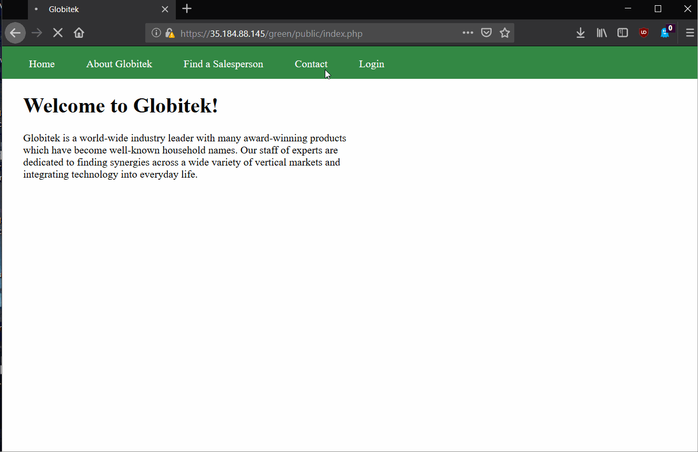

# week8codesh
# Project 8 - Pentesting Live Targets

1. Username Enumeration: A careless developer mistake has created a username enumeration vulnerability. Determine which color has the vulnerability. You can use the existing username "jmonroe99" as a test. Next, figure out what mistake the developer made.

Green has the vulnerability, the error given when login is unsuccesful in not bold when a non-existant user tries to log in.

